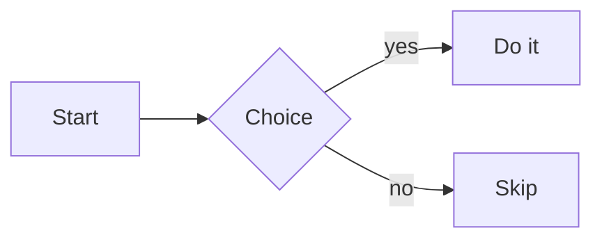

# Export to DOCX Implementation Plan

> **For agentic workers:** REQUIRED SUB-SKILL: Use superpowers:subagent-driven-development (recommended) or superpowers:executing-plans to implement this plan task-by-task. Steps use checkbox (`- [ ]`) syntax for tracking.

**Goal:** Add a one-click **Export to DOCX** action that turns the currently-viewed Markdown document into a real, editable Office Open XML `.docx` file, generated entirely inside the extension.

**Architecture:** A new self-contained content-script module `docx-export.js` builds the `.docx` by (1) walking the already-rendered `#md-content .md-body` DOM into WordprocessingML, (2) rasterizing Mermaid diagrams and KaTeX math to embedded PNGs, and (3) packing the OOXML parts + media into a ZIP with a hand-rolled _stored_ (uncompressed) ZIP writer. `content.js` owns the toolbar button and calls `window.MdDocx.export(...)`. The pure, browser-independent core (ZIP writer, XML builders, package assembler) is unit-tested with Node's built-in test runner; the DOM/canvas/UI parts are verified manually in the browser.

**Tech Stack:** Vanilla JS (ES2020), Manifest V3 content scripts, Canvas 2D + `XMLSerializer` for rasterization, `fetch` + `chrome.runtime.getURL` for media/fonts, Node built-in `node:test`/`node:assert` for the deterministic core. No bundler, no NPM runtime dependencies, no external CDN.

## Global Constraints

Every task's requirements implicitly include this section.

- **No runtime dependencies, no bundler, no CDN.** Ship only vanilla JS files. (Node's built-in `node:test` is a _dev-only_ tool; it is never loaded by the extension.)
- **Dual-mode module.** `docx-export.js` is NOT wrapped in an IIFE. Its pure functions live at module top level and are exported both ways at the bottom:
  ```js
  if (typeof window !== "undefined") {
    window.MdDocx = { export: exportDocx };
  }
  if (typeof module !== "undefined" && module.exports) {
    module.exports = {
      crc32,
      zipStore,
      escapeXml,
      contentTypesXml,
      rootRelsXml,
      documentRelsXml,
      stylesXml,
      numberingXml,
      documentXml,
      corePropsXml,
      assembleDocx,
    };
  }
  ```
- **No top-level DOM/chrome access.** `window`, `document`, `chrome`, `canvas`, `fetch` may only be referenced _inside functions_, never at module top level, so `require()` in Node does not throw.
- **All text is XML-escaped** via `escapeXml` before entering any XML string.
- **Units:** twips = 1/1440 in; EMU = 1/914400 in; 1 px @ 96 dpi = 9525 EMU. Page = US Letter `12240 × 15840` twips, `1440` twip (1 in) margins → content width `9360` twips = 6.5 in = **`5943600` EMU** (the max embedded-image width).
- **Light-themed output** regardless of the on-screen dark/light theme.
- **Tests run with:** `node --test` from the repo root (no install step).
- **Commits:** conventional-commit style, one per task's final step.

## File Structure

- **Create `docx-export.js`** — the entire exporter (ZIP writer, XML builders, DOM walker, rasterizers, orchestrator). One focused module, ~600 lines, matching the project's single-file convention (like `content.js`). Loaded as a content script _before_ `content.js`.
- **Create `test/docx-export.test.js`** — Node unit/integration tests for the pure core, including a small inline stored-ZIP reader used only by the tests.
- **Create `docx-export-test.md`** — a manual test fixture enumerating every supported element.
- **Modify `manifest.json`** — add `docx-export.js` to `content_scripts[0].js` before `content.js`.
- **Modify `content.js`** — add the Export button to `#md-bar .bar-right`, the click + `Ctrl+Shift+E` handlers, the pre-export preview flush, and the `window.MdDocx.export(...)` call.
- **Modify `content.css`** — styles for `#btn-export` and its spinner state.

## Testing Approach (read before starting)

This is a browser extension that emits a binary file; there is no DOM/canvas in Node.

- **Tasks 1–3** build the _pure, deterministic core_ and are **fully test-driven** with `node:test` — this is where a wrong byte silently corrupts the `.docx`, so it is where automated tests pay off most.
- **Tasks 4–12** touch the DOM, canvas, `chrome.*`, and the extension UI. These are **verified manually** in the browser against named fixtures with exact expected outcomes, and every one of them **re-runs `node --test`** as a regression guard on the core. Each browser task's "Manual verification" step IS its test cycle — do not skip it before committing.

---

### Task 1: Stored-ZIP writer (`crc32` + `zipStore`) with Node test harness

The foundation: a CRC32 and a ZIP writer that emits _stored_ (uncompressed) entries. Everything else gets packed by this.

**Files:**

- Create: `docx-export.js`
- Test: `test/docx-export.test.js`

**Interfaces:**

- Produces: `crc32(bytes: Uint8Array): number` (unsigned 32-bit), `zipStore(files: Array<{name: string, bytes: Uint8Array}>): Uint8Array`.

- [ ] **Step 1: Write the failing test**

Create `test/docx-export.test.js` (create the `test/` directory first if your editor doesn't auto-create parents):

```js
"use strict";
const test = require("node:test");
const assert = require("node:assert");
const { crc32, zipStore } = require("../docx-export.js");

const enc = (s) => new TextEncoder().encode(s);

// A minimal stored-ZIP reader — TEST-ONLY, proves zipStore output is a real ZIP.
function readZip(buf) {
  const dv = new DataView(buf.buffer, buf.byteOffset, buf.byteLength);
  // Find End Of Central Directory (0x06054b50), scanning from the end.
  let eocd = -1;
  for (let i = buf.length - 22; i >= 0; i--) {
    if (dv.getUint32(i, true) === 0x06054b50) {
      eocd = i;
      break;
    }
  }
  assert.ok(eocd >= 0, "EOCD signature present");
  const count = dv.getUint16(eocd + 10, true);
  let cd = dv.getUint32(eocd + 16, true);
  const out = {};
  for (let n = 0; n < count; n++) {
    assert.strictEqual(
      dv.getUint32(cd, true),
      0x02014b50,
      "central dir signature",
    );
    const crc = dv.getUint32(cd + 16, true) >>> 0;
    const nameLen = dv.getUint16(cd + 28, true);
    const extraLen = dv.getUint16(cd + 30, true);
    const cmtLen = dv.getUint16(cd + 32, true);
    const lho = dv.getUint32(cd + 42, true);
    const name = new TextDecoder().decode(
      buf.subarray(cd + 46, cd + 46 + nameLen),
    );
    // Read the local header to recover the data bytes.
    assert.strictEqual(
      dv.getUint32(lho, true),
      0x04034b50,
      "local header signature",
    );
    const lNameLen = dv.getUint16(lho + 26, true);
    const lExtraLen = dv.getUint16(lho + 28, true);
    const size = dv.getUint32(lho + 22, true); // compressed size (== uncompressed, stored)
    const dataStart = lho + 30 + lNameLen + lExtraLen;
    out[name] = { crc, bytes: buf.subarray(dataStart, dataStart + size) };
    cd += 46 + nameLen + extraLen + cmtLen;
  }
  return out;
}

test("crc32 known vectors", () => {
  assert.strictEqual(crc32(enc("")) >>> 0, 0x00000000);
  assert.strictEqual(crc32(enc("123456789")) >>> 0, 0xcbf43926);
});

test("zipStore round-trips names and bytes", () => {
  const files = [
    { name: "a.txt", bytes: enc("hello") },
    { name: "dir/b.xml", bytes: enc("<x/>") },
  ];
  const zip = zipStore(files);
  const read = readZip(zip);
  assert.deepStrictEqual(Object.keys(read).sort(), ["a.txt", "dir/b.xml"]);
  assert.strictEqual(new TextDecoder().decode(read["a.txt"].bytes), "hello");
  assert.strictEqual(read["dir/b.xml"].crc, crc32(enc("<x/>")) >>> 0);
});
```

- [ ] **Step 2: Run test to verify it fails**

Run: `node --test`
Expected: FAIL — `Cannot find module '../docx-export.js'`.

- [ ] **Step 3: Write minimal implementation**

Create `docx-export.js`:

```js
"use strict";
// docx-export.js — Export the rendered Markdown document to a real .docx (OOXML).
// Loaded as a content script before content.js; also require()-able in Node for
// unit-testing the pure core. No DOM/chrome access at module top level.

// ── CRC32 (IEEE 802.3) ───────────────────────────────────────────────────────
const _CRC_TABLE = (() => {
  const t = new Uint32Array(256);
  for (let n = 0; n < 256; n++) {
    let c = n;
    for (let k = 0; k < 8; k++) c = c & 1 ? 0xedb88320 ^ (c >>> 1) : c >>> 1;
    t[n] = c >>> 0;
  }
  return t;
})();

function crc32(bytes) {
  let c = 0xffffffff;
  for (let i = 0; i < bytes.length; i++)
    c = _CRC_TABLE[(c ^ bytes[i]) & 0xff] ^ (c >>> 8);
  return (c ^ 0xffffffff) >>> 0;
}

// ── Stored (uncompressed) ZIP writer ─────────────────────────────────────────
function zipStore(files) {
  const enc = new TextEncoder();
  const locals = [];
  const centrals = [];
  let offset = 0;

  for (const f of files) {
    if (!(f.bytes instanceof Uint8Array)) throw new Error('zipStore: ' + f.name + ' bytes must be Uint8Array');
    if (!f.name) throw new Error('zipStore: every entry needs a name');
    const nameBytes = enc.encode(f.name);
    const data = f.bytes;
    const crc = crc32(data);
    const size = data.length;

    const local = new Uint8Array(30 + nameBytes.length + size);
    const ldv = new DataView(local.buffer);
    ldv.setUint32(0, 0x04034b50, true); // local file header signature
    ldv.setUint16(4, 20, true); // version needed
    ldv.setUint16(6, 0, true); // flags
    ldv.setUint16(8, 0, true); // compression: 0 = stored
    ldv.setUint16(10, 0, true); // mod time
    ldv.setUint16(12, 0x21, true); // mod date (1980-01-01)
    ldv.setUint32(14, crc, true);
    ldv.setUint32(18, size, true); // compressed size
    ldv.setUint32(22, size, true); // uncompressed size
    ldv.setUint16(26, nameBytes.length, true);
    ldv.setUint16(28, 0, true); // extra length
    local.set(nameBytes, 30);
    local.set(data, 30 + nameBytes.length);
    locals.push(local);

    const central = new Uint8Array(46 + nameBytes.length);
    const cdv = new DataView(central.buffer);
    cdv.setUint32(0, 0x02014b50, true); // central dir signature
    cdv.setUint16(4, 20, true); // version made by
    cdv.setUint16(6, 20, true); // version needed
    cdv.setUint16(8, 0, true); // flags
    cdv.setUint16(10, 0, true); // compression
    cdv.setUint16(12, 0, true); // mod time
    cdv.setUint16(14, 0x21, true); // mod date
    cdv.setUint32(16, crc, true);
    cdv.setUint32(20, size, true);
    cdv.setUint32(24, size, true);
    cdv.setUint16(28, nameBytes.length, true);
    cdv.setUint16(30, 0, true); // extra len
    cdv.setUint16(32, 0, true); // comment len
    cdv.setUint16(34, 0, true); // disk number start
    cdv.setUint16(36, 0, true); // internal attrs
    cdv.setUint32(38, 0, true); // external attrs
    cdv.setUint32(42, offset, true); // local header offset
    central.set(nameBytes, 46);
    centrals.push(central);

    offset += local.length;
  }

  const cdSize = centrals.reduce((s, c) => s + c.length, 0);
  const cdOffset = offset;
  const eocd = new Uint8Array(22);
  const edv = new DataView(eocd.buffer);
  edv.setUint32(0, 0x06054b50, true); // EOCD signature
  edv.setUint16(4, 0, true); // disk number
  edv.setUint16(6, 0, true); // disk with CD
  edv.setUint16(8, files.length, true); // entries this disk
  edv.setUint16(10, files.length, true); // total entries
  edv.setUint32(12, cdSize, true);
  edv.setUint32(16, cdOffset, true);
  edv.setUint16(20, 0, true); // comment len

  let total = offset + cdSize + eocd.length;
  const out = new Uint8Array(total);
  let p = 0;
  for (const l of locals) {
    out.set(l, p);
    p += l.length;
  }
  for (const c of centrals) {
    out.set(c, p);
    p += c.length;
  }
  out.set(eocd, p);
  return out;
}

// ── Environment exports ──────────────────────────────────────────────────────
if (typeof module !== "undefined" && module.exports) {
  module.exports = { crc32, zipStore };
}
```

- [ ] **Step 4: Run test to verify it passes**

Run: `node --test`
Expected: PASS — 2 tests, both green.

- [ ] **Step 5: Commit**

```bash
git add docx-export.js test/docx-export.test.js
git commit -m "feat(docx): stored-ZIP writer and CRC32 with Node tests"
```

---

### Task 2: XML escaping and OOXML part builders

Pure string builders for every static (and semi-static) OOXML part.

**Files:**

- Modify: `docx-export.js`
- Test: `test/docx-export.test.js`

**Interfaces:**

- Consumes: nothing from prior tasks.
- Produces:
  - `escapeXml(s: string): string`
  - `contentTypesXml(exts: Set<string>): string` — `exts` is media extensions in use, e.g. `new Set(['png','jpeg'])`
  - `rootRelsXml(): string`
  - `documentRelsXml(rels: Array<{id:string,type:string,target:string,external?:boolean}>): string`
  - `stylesXml(): string`
  - `numberingXml(orderedNumIds: number[]): string`
  - `documentXml(bodyXml: string): string`
  - `corePropsXml(title: string): string`

- [ ] **Step 1: Write the failing test**

Append to `test/docx-export.test.js`:

```js
const {
  escapeXml,
  contentTypesXml,
  rootRelsXml,
  documentRelsXml,
  stylesXml,
  numberingXml,
  documentXml,
  corePropsXml,
} = require("../docx-export.js");

test("escapeXml handles the five predefined entities", () => {
  assert.strictEqual(
    escapeXml(`<a b="c" d='e' & f>`),
    "&lt;a b=&quot;c&quot; d=&apos;e&apos; &amp; f&gt;",
  );
});

test("contentTypesXml declares media extensions only when used", () => {
  const none = contentTypesXml(new Set());
  assert.ok(!none.includes("image/png"));
  const png = contentTypesXml(new Set(["png", "jpeg"]));
  assert.ok(png.includes('Extension="png" ContentType="image/png"'));
  assert.ok(png.includes('Extension="jpeg" ContentType="image/jpeg"'));
  assert.ok(png.includes("/word/document.xml"));
});

test("documentRelsXml always includes styles + numbering and appends dynamic rels", () => {
  const xml = documentRelsXml([
    {
      id: "rId3",
      type: "http://schemas.openxmlformats.org/officeDocument/2006/relationships/image",
      target: "media/img1.png",
    },
    {
      id: "rId4",
      type: "http://schemas.openxmlformats.org/officeDocument/2006/relationships/hyperlink",
      target: "https://example.com",
      external: true,
    },
  ]);
  assert.ok(xml.includes('Id="rId1"') && xml.includes("styles.xml"));
  assert.ok(xml.includes('Id="rId2"') && xml.includes("numbering.xml"));
  assert.ok(xml.includes('Id="rId3"') && xml.includes("media/img1.png"));
  assert.ok(xml.includes('TargetMode="External"'));
});

test("numberingXml emits one <w:num> per ordered list plus the shared bullet num", () => {
  const xml = numberingXml([2, 3]);
  assert.ok(xml.includes('w:numId="1"')); // bullets
  assert.ok(xml.includes('w:numId="2"')); // first ordered
  assert.ok(xml.includes('w:numId="3"')); // second ordered
  assert.ok(xml.includes("startOverride")); // restart each ordered list
  assert.ok(
    xml.includes('w:abstractNumId="0"') && xml.includes('w:abstractNumId="1"'),
  );
});

test("documentXml wraps the body and includes a sectPr", () => {
  const xml = documentXml("<w:p/>");
  assert.ok(xml.includes("<w:body><w:p/>"));
  assert.ok(xml.includes("w:pgSz"));
  assert.ok(xml.startsWith("<?xml"));
});

test("stylesXml and corePropsXml are non-empty and well-formed at the root", () => {
  assert.ok(stylesXml().includes('w:styleId="Heading1"'));
  assert.ok(stylesXml().includes('w:styleId="CodeBlock"'));
  assert.ok(corePropsXml("My & Title").includes("My &amp; Title"));
});

test("stylesXml respects OOXML child-element ordering (xsd:sequence)", () => {
  const s = stylesXml();
  // Heading rPr: w:color must precede w:sz.
  assert.ok(s.includes('<w:color w:val="111111"/><w:sz'), "heading color before sz");
  // Quote pPr: w:pBdr must precede w:ind.
  const q = s.indexOf('w:styleId="Quote"');
  assert.ok(s.indexOf("<w:pBdr>", q) < s.indexOf("<w:ind ", q), "quote pBdr before ind");
  // CodeBlock pPr: w:shd must precede w:spacing.
  const cb = s.indexOf('w:styleId="CodeBlock"');
  assert.ok(s.indexOf("<w:shd ", cb) < s.indexOf("<w:spacing ", cb), "codeblock shd before spacing");
});
```

- [ ] **Step 2: Run test to verify it fails**

Run: `node --test`
Expected: FAIL — `escapeXml`, `contentTypesXml`, etc. are `undefined` / not exported.

- [ ] **Step 3: Write minimal implementation**

In `docx-export.js`, add these functions _above_ the environment-exports block:

```js
// ── XML helpers ──────────────────────────────────────────────────────────────
const XML_DECL = '<?xml version="1.0" encoding="UTF-8" standalone="yes"?>\r\n';

function escapeXml(s) {
  return String(s)
    .replace(/&/g, "&amp;")
    .replace(/</g, "&lt;")
    .replace(/>/g, "&gt;")
    .replace(/"/g, "&quot;")
    .replace(/'/g, "&apos;");
}

// ── OOXML parts ──────────────────────────────────────────────────────────────
function contentTypesXml(exts) {
  const media = [];
  if (exts.has("png"))
    media.push('<Default Extension="png" ContentType="image/png"/>');
  if (exts.has("jpeg"))
    media.push('<Default Extension="jpeg" ContentType="image/jpeg"/>');
  return (
    XML_DECL +
    '<Types xmlns="http://schemas.openxmlformats.org/package/2006/content-types">' +
    '<Default Extension="rels" ContentType="application/vnd.openxmlformats-package.relationships+xml"/>' +
    '<Default Extension="xml" ContentType="application/xml"/>' +
    media.join("") +
    '<Override PartName="/word/document.xml" ContentType="application/vnd.openxmlformats-officedocument.wordprocessingml.document.main+xml"/>' +
    '<Override PartName="/word/styles.xml" ContentType="application/vnd.openxmlformats-officedocument.wordprocessingml.styles+xml"/>' +
    '<Override PartName="/word/numbering.xml" ContentType="application/vnd.openxmlformats-officedocument.wordprocessingml.numbering+xml"/>' +
    '<Override PartName="/docProps/core.xml" ContentType="application/vnd.openxmlformats-package.core-properties+xml"/>' +
    "</Types>"
  );
}

function rootRelsXml() {
  return (
    XML_DECL +
    '<Relationships xmlns="http://schemas.openxmlformats.org/package/2006/relationships">' +
    '<Relationship Id="rId1" Type="http://schemas.openxmlformats.org/officeDocument/2006/relationships/officeDocument" Target="word/document.xml"/>' +
    '<Relationship Id="rId2" Type="http://schemas.openxmlformats.org/package/2006/relationships/metadata/core-properties" Target="docProps/core.xml"/>' +
    "</Relationships>"
  );
}

function documentRelsXml(rels) {
  const fixed =
    '<Relationship Id="rId1" Type="http://schemas.openxmlformats.org/officeDocument/2006/relationships/styles" Target="styles.xml"/>' +
    '<Relationship Id="rId2" Type="http://schemas.openxmlformats.org/officeDocument/2006/relationships/numbering" Target="numbering.xml"/>';
  const dyn = rels
    .map(
      (r) =>
        `<Relationship Id="${r.id}" Type="${r.type}" Target="${escapeXml(r.target)}"${r.external ? ' TargetMode="External"' : ""}/>`,
    )
    .join("");
  return (
    XML_DECL +
    '<Relationships xmlns="http://schemas.openxmlformats.org/package/2006/relationships">' +
    fixed +
    dyn +
    "</Relationships>"
  );
}

function corePropsXml(title) {
  return (
    XML_DECL +
    '<cp:coreProperties xmlns:cp="http://schemas.openxmlformats.org/package/2006/metadata/core-properties"' +
    ' xmlns:dc="http://purl.org/dc/elements/1.1/">' +
    `<dc:title>${escapeXml(title)}</dc:title>` +
    "<dc:creator>Markdown Viewer</dc:creator>" +
    "</cp:coreProperties>"
  );
}

function documentXml(bodyXml) {
  return (
    XML_DECL +
    '<w:document xmlns:w="http://schemas.openxmlformats.org/wordprocessingml/2006/main"' +
    ' xmlns:r="http://schemas.openxmlformats.org/officeDocument/2006/relationships"' +
    ' xmlns:wp="http://schemas.openxmlformats.org/drawingml/2006/wordprocessingDrawing"' +
    ' xmlns:a="http://schemas.openxmlformats.org/drawingml/2006/main"' +
    ' xmlns:pic="http://schemas.openxmlformats.org/drawingml/2006/picture">' +
    "<w:body>" +
    bodyXml +
    "<w:sectPr>" +
    '<w:pgSz w:w="12240" w:h="15840"/>' +
    '<w:pgMar w:top="1440" w:right="1440" w:bottom="1440" w:left="1440" w:header="720" w:footer="720" w:gutter="0"/>' +
    "</w:sectPr>" +
    "</w:body></w:document>"
  );
}

function stylesXml() {
  const heading = (id, name, lvl, halfPt, color) =>
    `<w:style w:type="paragraph" w:styleId="${id}"><w:name w:val="${name}"/><w:basedOn w:val="Normal"/><w:next w:val="Normal"/>` +
    `<w:pPr><w:keepNext/><w:spacing w:before="240" w:after="120"/><w:outlineLvl w:val="${lvl}"/></w:pPr>` +
    `<w:rPr><w:b/><w:color w:val="${color}"/><w:sz w:val="${halfPt}"/><w:szCs w:val="${halfPt}"/></w:rPr></w:style>`;
  const border = 'w:val="single" w:sz="4" w:space="0" w:color="D0D7DE"';
  return (
    XML_DECL +
    '<w:styles xmlns:w="http://schemas.openxmlformats.org/wordprocessingml/2006/main">' +
    '<w:docDefaults><w:rPrDefault><w:rPr><w:rFonts w:ascii="Calibri" w:hAnsi="Calibri" w:cs="Calibri"/><w:sz w:val="22"/><w:szCs w:val="22"/></w:rPr></w:rPrDefault>' +
    '<w:pPrDefault><w:pPr><w:spacing w:after="160" w:line="276" w:lineRule="auto"/></w:pPr></w:pPrDefault></w:docDefaults>' +
    '<w:style w:type="paragraph" w:default="1" w:styleId="Normal"><w:name w:val="Normal"/></w:style>' +
    heading("Heading1", "heading 1", 0, 48, "111111") +
    heading("Heading2", "heading 2", 1, 36, "111111") +
    heading("Heading3", "heading 3", 2, 28, "111111") +
    heading("Heading4", "heading 4", 3, 24, "111111") +
    heading("Heading5", "heading 5", 4, 22, "333333") +
    heading("Heading6", "heading 6", 5, 22, "555555") +
    '<w:style w:type="paragraph" w:styleId="Quote"><w:name w:val="Quote"/><w:basedOn w:val="Normal"/>' +
    '<w:pPr><w:pBdr><w:left w:val="single" w:sz="18" w:space="12" w:color="D0D7DE"/></w:pBdr><w:ind w:left="480"/></w:pPr>' +
    '<w:rPr><w:i/><w:color w:val="57606A"/></w:rPr></w:style>' +
    '<w:style w:type="paragraph" w:styleId="ListParagraph"><w:name w:val="List Paragraph"/><w:basedOn w:val="Normal"/>' +
    '<w:pPr><w:spacing w:after="0"/><w:contextualSpacing/></w:pPr></w:style>' +
    '<w:style w:type="paragraph" w:styleId="CodeBlock"><w:name w:val="Code Block"/><w:basedOn w:val="Normal"/>' +
    '<w:pPr><w:shd w:val="clear" w:color="auto" w:fill="F6F8FA"/><w:spacing w:after="0" w:line="240" w:lineRule="auto"/></w:pPr>' +
    '<w:rPr><w:rFonts w:ascii="Consolas" w:hAnsi="Consolas" w:cs="Consolas"/><w:sz w:val="20"/><w:szCs w:val="20"/></w:rPr></w:style>' +
    '<w:style w:type="character" w:styleId="CodeChar"><w:name w:val="Code Char"/>' +
    '<w:rPr><w:rFonts w:ascii="Consolas" w:hAnsi="Consolas" w:cs="Consolas"/><w:sz w:val="20"/><w:szCs w:val="20"/><w:shd w:val="clear" w:color="auto" w:fill="EFF1F3"/></w:rPr></w:style>' +
    '<w:style w:type="character" w:styleId="Hyperlink"><w:name w:val="Hyperlink"/><w:rPr><w:color w:val="0969DA"/><w:u w:val="single"/></w:rPr></w:style>' +
    '<w:style w:type="table" w:default="1" w:styleId="TableGrid"><w:name w:val="Table Grid"/>' +
    `<w:tblPr><w:tblBorders><w:top ${border}/><w:left ${border}/><w:bottom ${border}/><w:right ${border}/><w:insideH ${border}/><w:insideV ${border}/></w:tblBorders></w:tblPr></w:style>` +
    "</w:styles>"
  );
}

function numberingXml(orderedNumIds) {
  const bulletChars = ["•", "◦", "▪", "•", "◦", "▪", "•", "◦", "▪"];
  let bulletLvls = "",
    decimalLvls = "";
  for (let i = 0; i < 9; i++) {
    const ind = 720 * (i + 1);
    bulletLvls +=
      `<w:lvl w:ilvl="${i}"><w:start w:val="1"/><w:numFmt w:val="bullet"/><w:lvlText w:val="${bulletChars[i]}"/>` +
      `<w:lvlJc w:val="left"/><w:pPr><w:ind w:left="${ind}" w:hanging="360"/></w:pPr></w:lvl>`;
    decimalLvls +=
      `<w:lvl w:ilvl="${i}"><w:start w:val="1"/><w:numFmt w:val="decimal"/><w:lvlText w:val="%${i + 1}."/>` +
      `<w:lvlJc w:val="left"/><w:pPr><w:ind w:left="${ind}" w:hanging="360"/></w:pPr></w:lvl>`;
  }
  const ordered = orderedNumIds
    .map(
      (id) =>
        `<w:num w:numId="${id}"><w:abstractNumId w:val="1"/>` +
        `<w:lvlOverride w:ilvl="0"><w:startOverride w:val="1"/></w:lvlOverride></w:num>`,
    )
    .join("");
  return (
    XML_DECL +
    '<w:numbering xmlns:w="http://schemas.openxmlformats.org/wordprocessingml/2006/main">' +
    `<w:abstractNum w:abstractNumId="0">${bulletLvls}</w:abstractNum>` +
    `<w:abstractNum w:abstractNumId="1">${decimalLvls}</w:abstractNum>` +
    '<w:num w:numId="1"><w:abstractNumId w:val="0"/></w:num>' +
    ordered +
    "</w:numbering>"
  );
}
```

Extend the Node export block at the bottom to include the new names (see the full list in the Global Constraints export snippet).

- [ ] **Step 4: Run test to verify it passes**

Run: `node --test`
Expected: PASS — all Task 1 + Task 2 tests green.

- [ ] **Step 5: Commit**

```bash
git add docx-export.js test/docx-export.test.js
git commit -m "feat(docx): OOXML part builders and XML escaping with tests"
```

---

### Task 3: Package assembler (`assembleDocx`)

Ties the parts + media into final `.docx` bytes.

**Files:**

- Modify: `docx-export.js`
- Test: `test/docx-export.test.js`

**Interfaces:**

- Consumes: `zipStore`, all Task 2 builders.
- Produces: `assembleDocx({ bodyXml: string, rels: Array, media: Array<{name:string,bytes:Uint8Array}>, exts: Set<string>, orderedNumIds: number[], title: string }): Uint8Array`. `media` names are package-relative under `word/`, e.g. `media/img1.png`.

- [ ] **Step 1: Write the failing test**

Append to `test/docx-export.test.js`:

```js
const { assembleDocx } = require("../docx-export.js");

test("assembleDocx produces a valid ZIP containing all required parts", () => {
  const bytes = assembleDocx({
    bodyXml: '<w:p><w:r><w:t xml:space="preserve">Hi</w:t></w:r></w:p>',
    rels: [],
    media: [],
    exts: new Set(),
    orderedNumIds: [],
    title: "Doc",
  });
  const read = readZip(bytes);
  for (const part of [
    "[Content_Types].xml",
    "_rels/.rels",
    "docProps/core.xml",
    "word/document.xml",
    "word/_rels/document.xml.rels",
    "word/styles.xml",
    "word/numbering.xml",
  ]) {
    assert.ok(read[part], "missing part: " + part);
  }
  const doc = new TextDecoder().decode(read["word/document.xml"].bytes);
  assert.ok(doc.includes('<w:t xml:space="preserve">Hi</w:t>'));
});

test("assembleDocx includes media files and their content-type declarations", () => {
  const bytes = assembleDocx({
    bodyXml: "<w:p/>",
    rels: [
      {
        id: "rId3",
        type: "http://schemas.openxmlformats.org/officeDocument/2006/relationships/image",
        target: "media/img1.png",
      },
    ],
    media: [{ name: "media/img1.png", bytes: new Uint8Array([1, 2, 3]) }],
    exts: new Set(["png"]),
    orderedNumIds: [],
    title: "Doc",
  });
  const read = readZip(bytes);
  assert.ok(read["word/media/img1.png"], "media file present");
  const ct = new TextDecoder().decode(read["[Content_Types].xml"].bytes);
  assert.ok(ct.includes("image/png"));
  const rels = new TextDecoder().decode(
    read["word/_rels/document.xml.rels"].bytes,
  );
  assert.ok(rels.includes("rId3") && rels.includes("media/img1.png"));
});
```

- [ ] **Step 2: Run test to verify it fails**

Run: `node --test`
Expected: FAIL — `assembleDocx` is not a function.

- [ ] **Step 3: Write minimal implementation**

Add to `docx-export.js` (above the exports block) and add `assembleDocx` to the Node export list:

```js
// ── Package assembler ────────────────────────────────────────────────────────
function assembleDocx({ bodyXml, rels, media, exts, orderedNumIds, title }) {
  const enc = new TextEncoder();
  const files = [
    { name: "[Content_Types].xml", bytes: enc.encode(contentTypesXml(exts)) },
    { name: "_rels/.rels", bytes: enc.encode(rootRelsXml()) },
    { name: "docProps/core.xml", bytes: enc.encode(corePropsXml(title)) },
    { name: "word/document.xml", bytes: enc.encode(documentXml(bodyXml)) },
    {
      name: "word/_rels/document.xml.rels",
      bytes: enc.encode(documentRelsXml(rels)),
    },
    { name: "word/styles.xml", bytes: enc.encode(stylesXml()) },
    {
      name: "word/numbering.xml",
      bytes: enc.encode(numberingXml(orderedNumIds)),
    },
  ];
  for (const m of media) files.push({ name: "word/" + m.name, bytes: m.bytes });
  return zipStore(files);
}
```

- [ ] **Step 4: Run test to verify it passes**

Run: `node --test`
Expected: PASS — all tests green.

- [ ] **Step 5: Real-file validity spot-check**

Run this one-off to confirm the bytes open as a real ZIP with Windows tooling:

```bash
node -e "const {assembleDocx}=require('./docx-export.js'); const fs=require('fs'); fs.writeFileSync('scratch-check.docx', Buffer.from(assembleDocx({bodyXml:'<w:p><w:r><w:t>Hi</w:t></w:r></w:p>',rels:[],media:[],exts:new Set(),orderedNumIds:[],title:'Doc'})));"
powershell -NoProfile -Command "Add-Type -AssemblyName System.IO.Compression.FileSystem; $z=[System.IO.Compression.ZipFile]::OpenRead((Resolve-Path 'scratch-check.docx')); $z.Entries.FullName; $z.Dispose()"
```

Expected: lists `[Content_Types].xml`, `word/document.xml`, etc. with no error. Then delete the scratch file:

```bash
rm scratch-check.docx
```

- [ ] **Step 6: Commit**

```bash
git add docx-export.js test/docx-export.test.js
git commit -m "feat(docx): package assembler producing valid .docx bytes"
```

---

### Task 4: Browser skeleton — build context, orchestrator, Export button, manifest wiring

First end-to-end slice: click **Export** → download a `.docx` with headings, paragraphs, and inline **bold/italic/strike/code/links**. Everything else degrades to plain paragraphs for now.

**Files:**

- Modify: `docx-export.js`
- Modify: `manifest.json`
- Modify: `content.js` (add button HTML in `render()` ~`content.js:1789`; wire handlers ~`content.js:1868`)
- Modify: `content.css`

**Interfaces:**

- Consumes: `assembleDocx`, `escapeXml`.
- Produces (browser globals via `window.MdDocx`):
  - `exportDocx({ container: HTMLElement, filename: string, title: string }): Promise<{ skipped: number }>`
- Internal (module-scope, browser-only): `createCtx()`, `blocksToOoxml(container, ctx)`, `inlineToRuns(node, ctx, rpr)`, `emuFromPx(px)`, `paragraph(styleId, innerXml, extraPPr)`, `runXml(text, rpr)`.

- [ ] **Step 1: Add the build context + inline/block walker (headings, paragraphs, inline formatting)**

Add to `docx-export.js` (browser-only functions; they reference `document`/`fetch` only when called). Place above the exports block:

```js
// ── EMU / sizing ─────────────────────────────────────────────────────────────
const MAX_IMG_W_EMU = 5943600; // 6.5in content width
function emuFromPx(px) {
  return Math.round(px * 9525);
}

// ── Build context (accumulates rels, media, numbering, ids, skip count) ──────
function createCtx() {
  return {
    rels: [], // {id, type, target, external}
    media: [], // {name, bytes}
    exts: new Set(), // 'png' | 'jpeg'
    orderedNumIds: [], // numIds for ordered lists (restart numbering)
    skipped: 0, // count of items that fell back to text
    _rid: 3, // rId1=styles, rId2=numbering are fixed
    _mediaN: 0,
    _docPr: 0,
    _numId: 1, // numId 1 = bullets; newOrderedNumId() returns 2, 3, …
    addImage(bytes, ext) {
      const id = "rId" + this._rid++;
      const name = `media/img${++this._mediaN}.${ext}`;
      this.media.push({ name, bytes });
      this.exts.add(ext);
      this.rels.push({
        id,
        type: "http://schemas.openxmlformats.org/officeDocument/2006/relationships/image",
        target: name,
      });
      return id;
    },
    addHyperlink(url) {
      const id = "rId" + this._rid++;
      this.rels.push({
        id,
        type: "http://schemas.openxmlformats.org/officeDocument/2006/relationships/hyperlink",
        target: url,
        external: true,
      });
      return id;
    },
    newOrderedNumId() {
      const n = ++this._numId;
      this.orderedNumIds.push(n);
      return n;
    },
    newDocPrId() {
      return ++this._docPr;
    },
  };
}

// ── Run / paragraph helpers ──────────────────────────────────────────────────
// rpr: { b, i, strike, code, color } → run properties XML
function rprXml(rpr) {
  if (!rpr) return "";
  let x = "";
  if (rpr.code) x += '<w:rStyle w:val="CodeChar"/>';
  else if (rpr.link) x += '<w:rStyle w:val="Hyperlink"/>';
  if (rpr.b) x += "<w:b/>";
  if (rpr.i) x += "<w:i/>";
  if (rpr.strike) x += "<w:strike/>";
  if (rpr.color) x += `<w:color w:val="${rpr.color}"/>`;
  return x ? `<w:rPr>${x}</w:rPr>` : "";
}

function runXml(text, rpr) {
  if (!text) return "";
  return `<w:r>${rprXml(rpr)}<w:t xml:space="preserve">${escapeXml(text)}</w:t></w:r>`;
}

function paragraph(styleId, innerXml, extraPPr) {
  const pPr =
    (styleId ? `<w:pStyle w:val="${styleId}"/>` : "") + (extraPPr || "");
  return `<w:p>${pPr ? `<w:pPr>${pPr}</w:pPr>` : ""}${innerXml}</w:p>`;
}

// ── Inline walker: DOM inline nodes → concatenated <w:r> runs ─────────────────
async function inlineToRuns(node, ctx, rpr) {
  let out = "";
  for (const child of node.childNodes) {
    if (child.nodeType === 3) {
      // text
      out += runXml(child.nodeValue, rpr);
      continue;
    }
    if (child.nodeType !== 1) continue; // skip comments etc.
    const tag = child.tagName.toLowerCase();
    if (tag === "br") {
      out += "<w:r><w:br/></w:r>";
      continue;
    }
    if (tag === "strong" || tag === "b") {
      out += await inlineToRuns(child, ctx, { ...rpr, b: true });
      continue;
    }
    if (tag === "em" || tag === "i") {
      out += await inlineToRuns(child, ctx, { ...rpr, i: true });
      continue;
    }
    if (tag === "del" || tag === "s" || tag === "strike") {
      out += await inlineToRuns(child, ctx, { ...rpr, strike: true });
      continue;
    }
    if (tag === "code") {
      out += await inlineToRuns(child, ctx, { ...rpr, code: true });
      continue;
    }
    if (tag === "a") {
      const href = child.getAttribute("href") || "";
      if (/^https?:|^mailto:/i.test(href)) {
        const id = ctx.addHyperlink(href);
        out += `<w:hyperlink r:id="${id}">${await inlineToRuns(child, ctx, { ...rpr, link: true })}</w:hyperlink>`;
      } else {
        out += await inlineToRuns(child, ctx, rpr); // internal anchors: keep text only
      }
      continue;
    }
    // Inline  (Task 9) and inline math (Task 11) branches get inserted here,
    // BEFORE this generic recurse fallback. Both walkers are async — always await.
    out += await inlineToRuns(child, ctx, rpr);
  }
  return out;
}

// ── Block walker: children of .md-body → body XML ────────────────────────────
async function blocksToOoxml(container, ctx) {
  let out = "";
  for (const el of container.children) {
    const tag = el.tagName.toLowerCase();
    if (/^h[1-6]$/.test(tag)) {
      out += paragraph("Heading" + tag[1], await inlineToRuns(el, ctx, null));
    } else if (tag === "p") {
      out += paragraph(null, await inlineToRuns(el, ctx, null));
      // ── Later tasks insert their block branches here, before the final else ──
    } else {
      // Fallback for unrecognized blocks: render their text as a paragraph.
      out += paragraph(null, await inlineToRuns(el, ctx, null));
    }
  }
  return out;
}
```

**Both `blocksToOoxml` and `inlineToRuns` are `async` from the start** so later tasks can `await` image/diagram/math embedding. Every block branch added in Tasks 5–11 goes *before the final `else`* and MUST `await` any `inlineToRuns` / `listToOoxml` / `tableToOoxml` / `imageRun` / `mathRun` / `diagramBlock` call. (`paragraph`, `runXml`, `rprXml`, `codeBlockToOoxml` are synchronous and returned strings — awaiting them is harmless but unnecessary.)

- [ ] **Step 2: Add the orchestrator + download**

Add to `docx-export.js` and set the `window.MdDocx` export at the bottom to `{ export: exportDocx }`:

```js
// ── Orchestrator ─────────────────────────────────────────────────────────────
async function exportDocx({ container, filename, title }) {
  const ctx = createCtx();
  const bodyXml = await blocksToOoxml(container, ctx);
  const bytes = assembleDocx({
    bodyXml,
    rels: ctx.rels,
    media: ctx.media,
    exts: ctx.exts,
    orderedNumIds: ctx.orderedNumIds,
    title: title || filename,
  });
  const blob = new Blob([bytes], {
    type: "application/vnd.openxmlformats-officedocument.wordprocessingml.document",
  });
  const url = URL.createObjectURL(blob);
  const a = document.createElement("a");
  a.href = url;
  a.download = filename;
  document.body.appendChild(a);
  a.click();
  a.remove();
  setTimeout(() => URL.revokeObjectURL(url), 2000);
  return { skipped: ctx.skipped };
}
```

At the very bottom of `docx-export.js`, replace the browser guard:

```js
if (typeof window !== "undefined") {
  window.MdDocx = { export: exportDocx };
}
```

- [ ] **Step 3: Wire the content script in `manifest.json`**

Change `content_scripts[0].js` so the exporter loads before `content.js`:

```json
"js": ["katex/katex.min.js", "docx-export.js", "content.js"],
```

- [ ] **Step 4: Add the Export button + handlers in `content.js`**

In `render()`, inside `<div class="bar-right">` (before the `#btn-search` button at ~`content.js:1789`), add:

```html
<button
  id="btn-export"
  title="Export to Word (.docx) — Ctrl+Shift+E"
  aria-label="Export to DOCX"
>
  <svg
    width="15"
    height="15"
    viewBox="0 0 24 24"
    fill="none"
    stroke="currentColor"
    stroke-width="2"
  >
    <path d="M14 2H6a2 2 0 0 0-2 2v16a2 2 0 0 0 2 2h12a2 2 0 0 0 2-2V8z" />
    <polyline points="14 2 14 8 20 8" />
    <path d="M8 13l1.5 4 1.5-3 1.5 3 1.5-4" />
  </svg>
  <span class="btn-label">DOCX</span>
</button>
```

Insert right after the `btn-dl` handler block (~`content.js:1872`) — the export handler and shortcut:

```js
// ── Export to DOCX ────────────────────────────────────────────────────────
document.getElementById("btn-export").addEventListener("click", doExport);
document.addEventListener("keydown", (e) => {
  if (
    (e.ctrlKey || e.metaKey) &&
    e.shiftKey &&
    (e.key === "E" || e.key === "e")
  ) {
    e.preventDefault();
    doExport();
  }
});
```

Add the `doExport` function near `saveFile`/`downloadFile` (~`content.js:1374`):

```js
const EXPORT_MD_EXT = /\.(md|markdown|mdown|mkd|mkdn|mdwn|mdtext)$/i;

async function doExport() {
  const btn = document.getElementById("btn-export");
  if (!btn || btn.classList.contains("exporting")) return;
  if (!window.MdDocx) {
    showToast("Export unavailable");
    return;
  }

  // Sync the preview DOM with any unsaved editor text before exporting.
  if (currentMode === "edit" || currentMode === "split") flushPreview();

  const container = document.querySelector("#md-content .md-body");
  if (!container) {
    showToast("Nothing to export");
    return;
  }

  const orig = btn.innerHTML;
  btn.classList.add("exporting");
  btn.disabled = true;
  btn.innerHTML =
    '<svg class="spin" width="15" height="15" viewBox="0 0 24 24" fill="none" stroke="currentColor" stroke-width="2"><path d="M21 12a9 9 0 1 1-6.219-8.56"/></svg><span class="btn-label">Exporting…</span>';

  try {
    const base = getFilename().replace(EXPORT_MD_EXT, "") || "document";
    const { skipped } = await window.MdDocx.export({
      container,
      filename: base + ".docx",
      title: document.title || base,
    });
    showToast(
      skipped
        ? `Exported — ${skipped} item${skipped > 1 ? "s" : ""} couldn't be embedded`
        : "Exported " + base + ".docx",
    );
  } catch (err) {
    console.error("DOCX export failed:", err);
    showToast("Export failed — see console");
  } finally {
    btn.classList.remove("exporting");
    btn.disabled = false;
    btn.innerHTML = orig;
  }
}
```

- [ ] **Step 5: Add button styles in `content.css`**

Append to `content.css`:

```css
/* ── Export to DOCX button ─────────────────────────────────────────────── */
#btn-export {
  display: inline-flex;
  align-items: center;
  gap: 5px;
  padding: 5px 10px;
  font-size: 12px;
  font-weight: 600;
}
#btn-export .btn-label {
  line-height: 1;
}
#btn-export[disabled] {
  opacity: 0.7;
  cursor: default;
}
#btn-export .spin {
  animation: md-spin 0.8s linear infinite;
}
@keyframes md-spin {
  to {
    transform: rotate(360deg);
  }
}
```

- [ ] **Step 6: Run the core regression tests**

Run: `node --test`
Expected: PASS — Tasks 1–3 still green (no core code changed).

- [ ] **Step 7: Manual verification**

1. In Chrome/Edge, go to `chrome://extensions`, reload the Markdown Viewer extension (ensure "Allow access to file URLs" is on).
2. Open `test.md` (a `file:///` URL) in the browser.
3. Click **DOCX** in the top-right bar (or press `Ctrl+Shift+E`).
4. Confirm a `test.docx` downloads and the button shows the spinner then restores.
5. Open `test.docx` in **Microsoft Word** (or Google Docs / LibreOffice). Expect: **no "unreadable content" repair prompt**, headings styled as headings, and **bold/italic/strikethrough/inline-code/links** rendered. (Lists, tables, code blocks, images, math, and diagrams may still be plain — later tasks.)

- [ ] **Step 8: Commit**

```bash
git add docx-export.js manifest.json content.js content.css
git commit -m "feat(docx): export button, orchestrator, headings + inline formatting"
```

---

### Task 5: Blockquotes, horizontal rules, and empty-paragraph handling

**Files:**

- Modify: `docx-export.js` (extend `blocksToOoxml`)

**Interfaces:**

- Consumes: `paragraph`, `inlineToRuns`, `blocksToOoxml`.
- Produces: no new exported names; extends `blocksToOoxml` block handling.

- [ ] **Step 1: Extend the block walker**

In `blocksToOoxml`, add these branches _before_ the final `else` fallback:

```js
    } else if (tag === 'blockquote') {
      // Emit each child block as a Quote-styled paragraph (await — inlineToRuns is async).
      // v1 limitation: nested lists/code/tables inside a quote are flattened to Quote
      // paragraph text rather than reproduced as nested structure — but never dropped.
      const kids = el.children.length ? [...el.children] : [el];
      for (const child of kids) out += paragraph('Quote', await inlineToRuns(child, ctx, null));
    } else if (tag === 'hr') {
      out += '<w:p><w:pPr><w:pBdr><w:bottom w:val="single" w:sz="6" w:space="1" w:color="D0D7DE"/></w:pBdr></w:pPr></w:p>';
```

- [ ] **Step 2: Run the core regression tests**

Run: `node --test`
Expected: PASS.

- [ ] **Step 3: Manual verification**

Create a scratch `file:///` fixture (or reuse `ALL-FEATURES-TEST.md`) containing a blockquote (`> quoted text`) and a horizontal rule (`---`). Reload the extension, export, open in Word. Expect: the quote is indented with a left bar and italic; the rule shows as a thin horizontal line.

- [ ] **Step 4: Commit**

```bash
git add docx-export.js
git commit -m "feat(docx): blockquotes and horizontal rules"
```

---

### Task 6: Lists (bulleted, numbered, nested, task lists)

**Files:**

- Modify: `docx-export.js` (extend `blocksToOoxml`; add `listToOoxml`)

**Interfaces:**

- Consumes: `paragraph`, `inlineToRuns`, `ctx.newOrderedNumId`.
- Produces: `listToOoxml(listEl, ctx, ilvl, numId): string`. Ordered `<ol>` at top level allocates a fresh `numId` via `ctx.newOrderedNumId()`; bullets always use `numId=1`.

- [ ] **Step 1: Add `listToOoxml` and wire it into the block walker**

Add function to `docx-export.js`:

```js
// ── Lists ────────────────────────────────────────────────────────────────────
async function listToOoxml(listEl, ctx, ilvl, numId) {
  const ordered = listEl.tagName.toLowerCase() === "ol";
  // Top-level ordered list gets its own numId so numbering restarts at 1.
  const myNumId = ordered ? (numId != null ? numId : ctx.newOrderedNumId()) : 1;
  let out = "";
  for (const li of listEl.children) {
    if (li.tagName.toLowerCase() !== "li") continue;

    // Task-list item: <li class="task-item"><label><input ...> text</label>…</li>
    const isTask = li.classList.contains("task-item");
    const checkbox = li.querySelector(
      ':scope > label > input[type="checkbox"]',
    );
    const glyph = isTask ? (checkbox && checkbox.checked ? "☑ " : "☐ ") : "";

    // Inline content of this item = the <li>/<label> minus nested lists.
    const source = li.querySelector(":scope > label") || li;
    let runs = "";
    if (glyph) runs += runXml(glyph, null);
    for (const node of source.childNodes) {
      if (node.nodeType === 1) {
        const t = node.tagName.toLowerCase();
        if (t === "ul" || t === "ol" || t === "input") continue; // nested lists / the checkbox handled separately
      }
      runs += await inlineToRuns({ childNodes: [node] }, ctx, null);
    }

    const numPr = `<w:numPr><w:ilvl w:val="${ilvl}"/><w:numId w:val="${isTask ? 1 : myNumId}"/></w:numPr>`;
    // Task items look best without a bullet marker → use ilvl but suppress via a plain paragraph.
    if (isTask) {
      out += paragraph(
        "ListParagraph",
        runs,
        `<w:ind w:left="${720 * (ilvl + 1)}" w:hanging="360"/>`,
      );
    } else {
      out += paragraph("ListParagraph", runs, numPr);
    }

    // Recurse into nested lists.
    for (const child of li.children) {
      const ct = child.tagName.toLowerCase();
      if (ct === "ul" || ct === "ol")
        out += await listToOoxml(child, ctx, ilvl + 1, null);
    }
  }
  return out;
}
```

Note: `inlineToRuns` is called with a synthetic `{ childNodes: [node] }` so a single node can be walked; this works because `inlineToRuns` only reads `.childNodes`. Text nodes and inline elements are handled uniformly.

In `blocksToOoxml`, add before the final `else`:

```js
    } else if (tag === 'ul' || tag === 'ol') {
      out += await listToOoxml(el, ctx, 0, null);
```

- [ ] **Step 2: Run the core regression tests**

Run: `node --test`
Expected: PASS. (Optionally add a `numberingXml` assertion that ordered numIds render — already covered in Task 2.)

- [ ] **Step 3: Manual verification**

Fixture with: a bulleted list with one nested level; a numbered list; a second numbered list (must restart at 1, not continue); and a task list with one checked and one unchecked item. Export, open in Word. Expect: bullets and numbers correct, nesting indented, second ordered list starts at 1, task items show ☑/☐ glyphs.

- [ ] **Step 4: Commit**

```bash
git add docx-export.js
git commit -m "feat(docx): bulleted, numbered, nested, and task lists"
```

---

### Task 7: Tables

**Files:**

- Modify: `docx-export.js` (extend `blocksToOoxml`; add `tableToOoxml`)

**Interfaces:**

- Consumes: `inlineToRuns`, `paragraph`, `escapeXml`.
- Produces: `tableToOoxml(tableEl, ctx): string`.

- [ ] **Step 1: Add `tableToOoxml` and wire it in**

Add to `docx-export.js`:

```js
// ── Tables ───────────────────────────────────────────────────────────────────
async function tableToOoxml(tableEl, ctx) {
  const rows = [...tableEl.querySelectorAll("tr")];
  // CT_Tbl requires <w:tblGrid> (one <w:gridCol/> per column) BETWEEN tblPr and the
  // rows. Omitting it triggers Word's "unreadable content — recover?" repair prompt
  // on every table.
  const firstRow = rows[0];
  const colCount = firstRow ? firstRow.querySelectorAll("th, td").length : 1;
  let gridCols = "";
  for (let i = 0; i < colCount; i++) gridCols += "<w:gridCol/>";

  let trs = "";
  for (const tr of rows) {
    // for...of (not .forEach) so we can await inlineToRuns per cell
    let tcs = "";
    for (const cell of tr.querySelectorAll("th, td")) {
      const isHeader = cell.tagName.toLowerCase() === "th";
      const align = (
        cell.style.textAlign ||
        cell.getAttribute("align") ||
        ""
      ).toLowerCase();
      const jc =
        align === "center"
          ? '<w:jc w:val="center"/>'
          : align === "right"
            ? '<w:jc w:val="right"/>'
            : "";
      const shd = isHeader
        ? '<w:shd w:val="clear" w:color="auto" w:fill="F0F0F0"/>'
        : "";
      const runs =
        (await inlineToRuns(cell, ctx, isHeader ? { b: true } : null)) || "";
      const p = `<w:p>${jc ? `<w:pPr>${jc}</w:pPr>` : ""}${runs}</w:p>`;
      tcs += `<w:tc><w:tcPr>${shd}</w:tcPr>${p}</w:tc>`;
    }
    trs += `<w:tr>${tcs}</w:tr>`;
  }
  return (
    '<w:tbl><w:tblPr><w:tblStyle w:val="TableGrid"/><w:tblW w:w="0" w:type="auto"/>' +
    '<w:tblLook w:val="04A0" w:firstRow="1" w:lastRow="0" w:firstColumn="1" w:lastColumn="0" w:noHBand="0" w:noVBand="1"/>' +
    "</w:tblPr>" +
    "<w:tblGrid>" +
    gridCols +
    "</w:tblGrid>" +
    trs +
    "</w:tbl>"
  );
}
```

In `blocksToOoxml`, add before the final `else`:

```js
    } else if (tag === 'table') {
      out += await tableToOoxml(el, ctx);
```

- [ ] **Step 2: Run the core regression tests**

Run: `node --test`
Expected: PASS.

- [ ] **Step 3: Manual verification**

Fixture with a GFM table including a header row and an alignment column (`:---:`). Export, open in Word. Expect: a bordered table, bold shaded header row, and center/right alignment preserved.

- [ ] **Step 4: Commit**

```bash
git add docx-export.js
git commit -m "feat(docx): GFM tables with header shading and alignment"
```

---

### Task 8: Code blocks with syntax colors

**Files:**

- Modify: `docx-export.js` (extend `blocksToOoxml`; add `codeBlockToOoxml`)

**Interfaces:**

- Consumes: `paragraph`, `runXml`, `escapeXml`.
- Produces: `codeBlockToOoxml(wrapEl, ctx): string`. Input is a `.cb-wrap` element (`.cb-wrap > pre > code`). Each source line → one `CodeBlock`-styled paragraph; `sh-*` spans → colored `Consolas` runs.

- [ ] **Step 1: Add the token→color map and `codeBlockToOoxml`**

Add to `docx-export.js`:

```js
// ── Code blocks (syntax-highlighted) ─────────────────────────────────────────
// Maps the renderer's sh-* token classes to GitHub-light hex colors.
const SH_COLORS = {
  "sh-kw": "CF222E",
  "sh-str": "0A3069",
  "sh-cmt": "6E7781",
  "sh-num": "0550AE",
  "sh-fn": "8250DF",
  "sh-tag": "116329",
  "sh-attr": "953800",
  "sh-prop": "8250DF",
  "sh-key": "0550AE",
};
const CODE_DEFAULT = "24292F";

function codeBlockToOoxml(wrapEl, ctx) {
  const codeEl = wrapEl.querySelector("pre > code");
  if (!codeEl) return "";
  // Build a flat list of {text, color} runs from the highlighted markup,
  // then split into lines on '\n' so each line is its own shaded paragraph.
  const runs = [];
  (function walk(node, color) {
    for (const child of node.childNodes) {
      if (child.nodeType === 3) {
        runs.push({ text: child.nodeValue, color });
        continue;
      }
      if (child.nodeType !== 1) continue;
      let c = color;
      for (const cls of child.classList)
        if (SH_COLORS[cls]) {
          c = SH_COLORS[cls];
          break;
        }
      walk(child, c);
    }
  })(codeEl, CODE_DEFAULT);

  // Split runs across newlines into per-line arrays.
  const lines = [[]];
  for (const r of runs) {
    const parts = r.text.split("\n");
    for (let i = 0; i < parts.length; i++) {
      if (i > 0) lines.push([]);
      if (parts[i])
        lines[lines.length - 1].push({ text: parts[i], color: r.color });
    }
  }
  // Drop a trailing empty line (from a final newline in the code text).
  if (lines.length > 1 && lines[lines.length - 1].length === 0) lines.pop();

  let out = "";
  for (const line of lines) {
    let inner = "";
    for (const seg of line) {
      inner += runXml(seg.text, {
        code: true,
        color: seg.color === CODE_DEFAULT ? null : seg.color,
      });
    }
    out += paragraph("CodeBlock", inner);
  }
  return out;
}
```

In `blocksToOoxml`, add before the final `else`:

```js
    } else if (el.classList.contains('cb-wrap')) {
      out += codeBlockToOoxml(el, ctx);
```

Note: put this branch _before_ the generic checks since `.cb-wrap` is a `div`.

- [ ] **Step 2: Run the core regression tests**

Run: `node --test`
Expected: PASS.

- [ ] **Step 3: Manual verification**

Fixture with a fenced ` ```js ` block containing keywords, strings, comments, and numbers. Export, open in Word. Expect: a light-gray code block, monospace `Consolas`, each line preserved, and keyword/string/comment/number colors matching the on-screen light theme.

- [ ] **Step 4: Commit**

```bash
git add docx-export.js
git commit -m "feat(docx): syntax-colored code blocks on shaded background"
```

---

### Task 9: Raster images (``) with graceful fallback

**Files:**

- Modify: `docx-export.js` (add image helpers + `drawingXml`; handle `img` in block + inline walkers)

**Interfaces:**

- Consumes: `ctx.addImage`, `ctx.newDocPrId`, `emuFromPx`, `MAX_IMG_W_EMU`.
- Produces:
  - `imgToBytes(imgEl): Promise<{ bytes, ext, wPx, hPx } | null>` (null on fetch/decode failure)
  - `drawingXml(rId, cxEmu, cyEmu, docPrId, inline=true): string`
  - `imageRun(imgEl, ctx): Promise<string>` — returns an image `<w:r>` run (or an italic placeholder run on failure); block callers wrap it in `<w:p>…</w:p>`.

- [ ] **Step 1: Add image helpers and drawing XML**

Add to `docx-export.js`:

```js
// ── Images ───────────────────────────────────────────────────────────────────
function extFromMime(mime) {
  if (/png/i.test(mime)) return "png";
  if (/jpe?g/i.test(mime)) return "jpeg";
  return null;
}

async function bitmapToPng(blob) {
  const bmp = await createImageBitmap(blob);
  const canvas = document.createElement("canvas");
  canvas.width = bmp.width;
  canvas.height = bmp.height;
  const ctx2d = canvas.getContext("2d");
  ctx2d.drawImage(bmp, 0, 0);
  const png = await new Promise((res, rej) =>
    canvas.toBlob(
      (b) => (b ? res(b) : rej(new Error("toBlob failed"))),
      "image/png",
    ),
  );
  return {
    bytes: new Uint8Array(await png.arrayBuffer()),
    w: bmp.width,
    h: bmp.height,
  };
}

async function imgToBytes(imgEl) {
  const src = imgEl.currentSrc || imgEl.getAttribute("src") || "";
  if (!src) return null;
  try {
    const resp = await fetch(src);
    if (!resp.ok) throw new Error("HTTP " + resp.status);
    const blob = await resp.blob();
    let ext = extFromMime(blob.type);
    if (ext === "png" || ext === "jpeg") {
      const bmp = await createImageBitmap(blob);
      const bytes = new Uint8Array(await blob.arrayBuffer());
      const dims = { w: bmp.width, h: bmp.height };
      return { bytes, ext, wPx: dims.w, hPx: dims.h };
    }
    // gif/webp/svg/bmp → normalize to PNG
    const norm = await bitmapToPng(blob);
    return { bytes: norm.bytes, ext: "png", wPx: norm.w, hPx: norm.h };
  } catch (e) {
    return null;
  }
}

// Scale (wPx,hPx) down so width never exceeds the content area; return EMUs.
function fitEmu(wPx, hPx) {
  let cx = emuFromPx(wPx),
    cy = emuFromPx(hPx);
  if (cx > MAX_IMG_W_EMU) {
    cy = Math.round(cy * (MAX_IMG_W_EMU / cx));
    cx = MAX_IMG_W_EMU;
  }
  return { cx: Math.max(1, cx), cy: Math.max(1, cy) };
}

function drawingXml(rId, cx, cy, docPrId, inline) {
  const anchor = inline ? "wp:inline" : "wp:inline"; // block images are inline in their own paragraph
  return (
    `<w:r><w:drawing><${anchor} distT="0" distB="0" distL="0" distR="0">` +
    `<wp:extent cx="${cx}" cy="${cy}"/><wp:effectExtent l="0" t="0" r="0" b="0"/>` +
    `<wp:docPr id="${docPrId}" name="Picture ${docPrId}"/>` +
    '<wp:cNvGraphicFramePr><a:graphicFrameLocks xmlns:a="http://schemas.openxmlformats.org/drawingml/2006/main" noChangeAspect="1"/></wp:cNvGraphicFramePr>' +
    '<a:graphic xmlns:a="http://schemas.openxmlformats.org/drawingml/2006/main">' +
    '<a:graphicData uri="http://schemas.openxmlformats.org/drawingml/2006/picture">' +
    '<pic:pic xmlns:pic="http://schemas.openxmlformats.org/drawingml/2006/picture">' +
    `<pic:nvPicPr><pic:cNvPr id="${docPrId}" name="Picture ${docPrId}"/><pic:cNvPicPr/></pic:nvPicPr>` +
    `<pic:blipFill><a:blip r:embed="${rId}"/><a:stretch><a:fillRect/></a:stretch></pic:blipFill>` +
    `<pic:spPr><a:xfrm><a:off x="0" y="0"/><a:ext cx="${cx}" cy="${cy}"/></a:xfrm>` +
    '<a:prstGeom prst="rect"><a:avLst/></a:prstGeom></pic:spPr>' +
    `</pic:pic></a:graphicData></a:graphic></${anchor}></w:drawing></w:r>`
  );
}

async function imageRun(imgEl, ctx) {
  const data = await imgToBytes(imgEl);
  if (!data) {
    ctx.skipped++;
    const alt = imgEl.getAttribute("alt") || "image";
    return runXml(`[image: ${alt} — could not embed]`, {
      i: true,
      color: "999999",
    });
  }
  const rId = ctx.addImage(data.bytes, data.ext);
  const { cx, cy } = fitEmu(data.wPx, data.hPx);
  return drawingXml(rId, cx, cy, ctx.newDocPrId(), true);
}
```

- [ ] **Step 2: Add image branches to the walkers**

Both `blocksToOoxml` and `inlineToRuns` are already `async` (Task 4), so just add awaited branches — no signature changes.

In `blocksToOoxml`, add before the final `else`. The renderer wraps every image as `<div class="img-wrap">…<button class="img-download-btn">…</button></div>`, and the HTML parser hoists that block `<div>` out of any `<p>`, so this block branch is the real image handler:

```js
    } else if (el.classList.contains('img-wrap')) {
      const img = el.querySelector('img');
      out += img ? `<w:p>${await imageRun(img, ctx)}</w:p>` : '';
```

In `inlineToRuns`, add these two branches *before* the generic recurse fallback (`out += await inlineToRuns(child, ctx, rpr);`):

```js
    if (tag === 'img') { out += await imageRun(child, ctx); continue; }        // defensive: raw inline 
    if (child.classList && child.classList.contains('img-download-btn')) { continue; } // skip UI chrome
```

- [ ] **Step 3: Run the core regression tests**

Run: `node --test`
Expected: PASS (pure core unchanged; the assembler still receives a `bodyXml` string).

- [ ] **Step 4: Manual verification**

Fixture with (a) a local image next to the `.md` file and (b) a remote `https://` image plus (c) a deliberately broken image URL. Export, open in Word. Expect: local image embedded at a sensible size (≤ page width); remote image embedded if reachable; broken image shows the italic gray `[image: … — could not embed]` placeholder; the success toast reports the skipped count.

- [ ] **Step 5: Commit**

```bash
git add docx-export.js
git commit -m "feat(docx): embed images with sizing and fallback placeholders"
```

---

### Task 10: Mermaid diagram rasterization

**Files:**

- Modify: `docx-export.js` (add `svgToPng`; handle `.mermaid-wrap` / `.mermaid-pending` / `.mermaid-error`)

**Interfaces:**

- Consumes: `ctx.addImage`, `drawingXml`, `fitEmu`, `paragraph`, `codeBlockToOoxml` (for source fallback).
- Produces: `svgToPng(svgEl, scale=2): Promise<{ bytes, wPx, hPx }>`, `diagramBlock(el, ctx): Promise<string>`.

- [ ] **Step 1: Force light-themed diagrams (content.js), then add the SVG rasterizer**

Mermaid bakes the on-screen theme into each rendered SVG (`_mermaidTheme()` returns `'dark'` only when `document.documentElement.dataset.theme === 'dark'`). To honor the light-themed-output guarantee, re-render diagrams in light theme for the duration of the export. **Replace the Task 4 `doExport` body** in `content.js` with this version (it wraps the export in a theme guard):

```js
async function doExport() {
  const btn = document.getElementById('btn-export');
  if (!btn || btn.classList.contains('exporting')) return;
  if (!window.MdDocx) { showToast('Export unavailable'); return; }
  if (currentMode === 'edit' || currentMode === 'split') flushPreview();

  const container = document.querySelector('#md-content .md-body');
  if (!container) { showToast('Nothing to export'); return; }

  const orig = btn.innerHTML;
  btn.classList.add('exporting');
  btn.disabled = true;
  btn.innerHTML = '<svg class="spin" width="15" height="15" viewBox="0 0 24 24" fill="none" stroke="currentColor" stroke-width="2"><path d="M21 12a9 9 0 1 1-6.219-8.56"/></svg><span class="btn-label">Exporting…</span>';

  // Diagrams bake in the current theme; force light so exported PNGs match the light doc.
  const root = document.documentElement;
  const prevTheme = root.dataset.theme;
  const forceLight = prevTheme === 'dark' && !!document.querySelector('.mermaid-wrap[data-diagram]');
  if (forceLight) { root.dataset.theme = 'light'; await refreshMermaidTheme(); }

  try {
    const base = (getFilename().replace(EXPORT_MD_EXT, '') || 'document');
    const { skipped } = await window.MdDocx.export({
      container,
      filename: base + '.docx',
      title: document.title || base,
    });
    showToast(skipped
      ? `Exported — ${skipped} item${skipped > 1 ? 's' : ''} couldn't be embedded`
      : 'Exported ' + base + '.docx');
  } catch (err) {
    console.error('DOCX export failed:', err);
    showToast('Export failed — see console');
  } finally {
    if (forceLight) { root.dataset.theme = prevTheme; await refreshMermaidTheme(); }
    btn.classList.remove('exporting');
    btn.disabled = false;
    btn.innerHTML = orig;
  }
}
```

`refreshMermaidTheme` is an existing `content.js` function (`content.js:653`) that re-renders all `.mermaid-wrap[data-diagram]` blocks for the current theme. Then add the rasterizer to `docx-export.js`:

```js
// ── SVG → PNG rasterization ──────────────────────────────────────────────────
function loadImage(url) {
  return new Promise((res, rej) => {
    const img = new Image();
    img.onload = () => res(img);
    img.onerror = () => rej(new Error("image load failed"));
    img.src = url;
  });
}

async function svgToPng(svgEl, scale) {
  scale = scale || 2;
  const rect = svgEl.getBoundingClientRect();
  const w = Math.max(
    1,
    Math.ceil(rect.width || parseFloat(svgEl.getAttribute("width")) || 300),
  );
  const h = Math.max(
    1,
    Math.ceil(rect.height || parseFloat(svgEl.getAttribute("height")) || 200),
  );
  const clone = svgEl.cloneNode(true);
  clone.setAttribute("xmlns", "http://www.w3.org/2000/svg");
  clone.setAttribute("width", w);
  clone.setAttribute("height", h);
  const svgStr = new XMLSerializer().serializeToString(clone);
  const url = "data:image/svg+xml;charset=utf-8," + encodeURIComponent(svgStr);
  const img = await loadImage(url);
  const canvas = document.createElement("canvas");
  canvas.width = w * scale;
  canvas.height = h * scale;
  const c = canvas.getContext("2d");
  c.fillStyle = "#ffffff";
  c.fillRect(0, 0, canvas.width, canvas.height);
  c.drawImage(img, 0, 0, canvas.width, canvas.height);
  const png = await new Promise((res, rej) =>
    canvas.toBlob(
      (b) => (b ? res(b) : rej(new Error("toBlob failed"))),
      "image/png",
    ),
  );
  return { bytes: new Uint8Array(await png.arrayBuffer()), wPx: w, hPx: h };
}

async function diagramBlock(el, ctx) {
  const svg = el.querySelector("svg");
  if (svg) {
    try {
      const { bytes, wPx, hPx } = await svgToPng(svg, 2);
      const rId = ctx.addImage(bytes, "png");
      const { cx, cy } = fitEmu(wPx, hPx);
      return `<w:p>${drawingXml(rId, cx, cy, ctx.newDocPrId(), true)}</w:p>`;
    } catch (e) {
      // fall through to source fallback
    }
  }
  // Fallback: render the mermaid source as a code block.
  ctx.skipped++;
  const source = el.getAttribute("data-diagram") || el.textContent || "";
  let out = "";
  for (const line of String(source).split("\n"))
    out += paragraph("CodeBlock", runXml(line, { code: true }));
  return out;
}
```

In `blocksToOoxml`, add before the final `else`:

```js
    } else if (el.classList.contains('mermaid-wrap') || el.classList.contains('mermaid-pending') || el.classList.contains('mermaid-error')) {
      out += await diagramBlock(el, ctx);
```

- [ ] **Step 2: Run the core regression tests**

Run: `node --test`
Expected: PASS.

- [ ] **Step 3: Manual verification**

Fixture with a ` ```mermaid ` flowchart. Open in the browser, scroll so the diagram renders (SVG present), then export and open in Word. Expect: the diagram embedded as a crisp image on a white background. Then export a second doc immediately after opening (diagram not yet scrolled into view / not rendered) and confirm it falls back to the mermaid source as a code block and increments the skipped count.

- [ ] **Step 4: Commit**

```bash
git add docx-export.js
git commit -m "feat(docx): rasterize Mermaid diagrams to embedded PNGs with source fallback"
```

---

### Task 11: KaTeX math rasterization with font inlining and TeX fallback

The riskiest unit: rasterizing HTML+font math via `foreignObject`. The TeX fallback guarantees no silent loss.

**Files:**

- Modify: `docx-export.js` (add `mathToPng` + font/CSS inlining; handle `.math-inline` / `.math-block`)

**Interfaces:**

- Consumes: `ctx.addImage`, `drawingXml`, `fitEmu`, `runXml`, `loadImage`, `chrome.runtime.getURL`.
- Produces:
  - `mathToPng(katexEl): Promise<{ bytes, wPx, hPx }>` (throws on taint/failure → caller falls back)
  - `mathRun(mathEl, ctx, display): Promise<string>` — inline run or block paragraph, with TeX fallback.

- [ ] **Step 1: Add base64, KaTeX CSS/font inlining, and `mathToPng`**

Add to `docx-export.js`:

```js
// ── KaTeX math rasterization ─────────────────────────────────────────────────
function bytesToBase64(bytes) {
  let bin = "";
  const chunk = 0x8000;
  for (let i = 0; i < bytes.length; i += chunk) {
    bin += String.fromCharCode.apply(null, bytes.subarray(i, i + chunk));
  }
  return btoa(bin);
}

let _katexCssCache = null;
async function fetchKatexCss() {
  if (_katexCssCache != null) return _katexCssCache;
  const resp = await fetch(chrome.runtime.getURL("katex/katex.min.css"));
  _katexCssCache = await resp.text();
  return _katexCssCache;
}

const _fontUriCache = new Map();
async function fontDataUri(file) {
  if (_fontUriCache.has(file)) return _fontUriCache.get(file);
  const resp = await fetch(chrome.runtime.getURL("katex/fonts/" + file));
  const bytes = new Uint8Array(await resp.arrayBuffer());
  const uri = "data:font/woff2;base64," + bytesToBase64(bytes);
  _fontUriCache.set(file, uri);
  return uri;
}

// Build inlined CSS: layout rules verbatim + @font-face (used families only) with data-URI woff2.
async function katexInlineCss(katexEl) {
  const raw = await fetchKatexCss();
  const used = new Set([
    "KaTeX_Main",
    "KaTeX_Math",
    "KaTeX_Size1",
    "KaTeX_Size2",
  ]);
  katexEl.querySelectorAll("*").forEach((n) => {
    const ff = getComputedStyle(n).fontFamily || "";
    ff.split(",").forEach((f) => {
      const name = f.trim().replace(/["']/g, "");
      if (name.indexOf("KaTeX_") === 0) used.add(name);
    });
  });
  const faceRe = /@font-face\s*\{[^}]*\}/g;
  const layout = raw.replace(faceRe, "");
  const faces = raw.match(faceRe) || [];
  let inlined = "";
  for (const block of faces) {
    const famM = block.match(/font-family\s*:\s*([^;}]+)/i);
    if (!famM) continue;
    const fam = famM[1].trim().replace(/["']/g, "");
    if (!used.has(fam)) continue;
    const woff2M = block.match(
      /url\(\s*['"]?fonts\/([^)'"]+\.woff2)['"]?\s*\)/i,
    );
    if (!woff2M) {
      inlined += block;
      continue;
    }
    const uri = await fontDataUri(woff2M[1]);
    const wM = block.match(/font-weight\s*:\s*([^;}]+)/i);
    const sM = block.match(/font-style\s*:\s*([^;}]+)/i);
    inlined +=
      `@font-face{font-family:${fam};src:url(${uri}) format("woff2");` +
      `font-weight:${wM ? wM[1].trim() : "normal"};font-style:${sM ? sM[1].trim() : "normal"}}`;
  }
  return inlined + layout;
}

async function mathToPng(katexEl) {
  const css = await katexInlineCss(katexEl);
  const rect = katexEl.getBoundingClientRect();
  const pad = 2;
  const w = Math.max(1, Math.ceil(rect.width) + pad * 2);
  const h = Math.max(1, Math.ceil(rect.height) + pad * 2);
  const inner = new XMLSerializer().serializeToString(katexEl);
  const html = `<div xmlns="http://www.w3.org/1999/xhtml" style="display:inline-block;padding:${pad}px;color:#111111;background:#ffffff;">${inner}</div>`;
  const svg =
    `<svg xmlns="http://www.w3.org/2000/svg" width="${w}" height="${h}">` +
    `<foreignObject width="${w}" height="${h}"><style>${css}</style>${html}</foreignObject></svg>`;
  const url = "data:image/svg+xml;charset=utf-8," + encodeURIComponent(svg);
  const img = await loadImage(url);
  const scale = 2;
  const canvas = document.createElement("canvas");
  canvas.width = w * scale;
  canvas.height = h * scale;
  const c = canvas.getContext("2d");
  c.fillStyle = "#ffffff";
  c.fillRect(0, 0, canvas.width, canvas.height);
  c.drawImage(img, 0, 0, canvas.width, canvas.height);
  const png = await new Promise((res, rej) =>
    canvas.toBlob(
      (b) => (b ? res(b) : rej(new Error("toBlob failed"))),
      "image/png",
    ),
  );
  return { bytes: new Uint8Array(await png.arrayBuffer()), wPx: w, hPx: h };
}

async function mathRun(mathEl, ctx, display) {
  // KaTeX failure renders <span class="math-error">tex</span> (no .katex, no annotation) —
  // emit it as red monospace text directly; don't waste a rasterize attempt on it.
  const errEl = mathEl.classList.contains("math-error")
    ? mathEl
    : mathEl.querySelector(".math-error");
  if (errEl) {
    const runs = runXml(errEl.textContent || "", { code: true, color: "CF222E" });
    return display ? paragraph("CodeBlock", runs) : runs;
  }
  const katexEl = mathEl.querySelector(".katex") || mathEl;
  try {
    const { bytes, wPx, hPx } = await mathToPng(katexEl);
    const rId = ctx.addImage(bytes, "png");
    const { cx, cy } = fitEmu(wPx, hPx);
    const run = drawingXml(rId, cx, cy, ctx.newDocPrId(), true);
    return display
      ? `<w:p><w:pPr><w:jc w:val="center"/></w:pPr>${run}</w:p>`
      : run;
  } catch (e) {
    ctx.skipped++;
    const ann = mathEl.querySelector(
      'annotation[encoding="application/x-tex"]',
    );
    const tex = ann ? ann.textContent : mathEl.textContent || "";
    const runs = runXml(tex, { code: true });
    return display ? paragraph("CodeBlock", runs) : runs;
  }
}
```

- [ ] **Step 2: Wire math into the walkers**

In `blocksToOoxml`, add before the final `else`:

```js
    } else if (el.classList.contains('math-block')) {
      out += await mathRun(el, ctx, true);
```

In `inlineToRuns`, before the generic recurse fallback, add:

```js
    if (child.classList && child.classList.contains('math-inline')) { out += await mathRun(child, ctx, false); continue; }
    if (child.classList && child.classList.contains('math-block')) { out += await mathRun(child, ctx, true); continue; } // safety net if a block div lands inline
    if (child.classList && child.classList.contains('math-error')) { out += runXml(child.textContent || '', { code: true, color: 'CF222E' }); continue; }
```

- [ ] **Step 3: Run the core regression tests**

Run: `node --test`
Expected: PASS.

- [ ] **Step 4: Manual verification**

Use `math-test.md`. Export, open in Word. Expect: inline `$…$` math appears as small inline images on the text baseline; display `$$…$$` math appears centered as block images; both are crisp with correct glyphs (fonts inlined). Then force a fallback: temporarily rename `katex/fonts` (or use a malformed `$\frac{`) and confirm the affected math degrades to monospace TeX text and the skipped count reflects it. Restore afterward.

- [ ] **Step 5: Commit**

```bash
git add docx-export.js
git commit -m "feat(docx): rasterize KaTeX math with font inlining and TeX fallback"
```

---

### Task 12: Test fixture and full acceptance pass

**Files:**

- Create: `docx-export-test.md`

**Interfaces:** none (documentation/fixture + final verification).

- [ ] **Step 1: Create the fixture**

Create `docx-export-test.md`:

````markdown
# DOCX Export Test

Paragraph with **bold**, _italic_, ~~strike~~, `inline code`, and a [link](https://example.com).

## Lists

- Bullet one
  - Nested bullet
- Bullet two

1. First
2. Second

3. Restarted list first
4. Restarted list second

- [x] Done task
- [ ] Pending task

## Blockquote

> A quoted line.

## Table

| Name  | Qty | Price |
| :---- | :-: | ----: |
| Apple |  3  |  1.20 |
| Pear  |  5  |  0.90 |

---

## Code

```js
function greet(name) {
  // say hello
  return `Hello, ${name}` + 42;
}
```
````

## Math

Inline $E = mc^2$ and display:

$$\int_0^\infty e^{-x}\,dx = 1$$

## Diagram



## Image


````

- [ ] **Step 2: Full acceptance verification**

1. Run `node --test` → all core tests PASS.
2. Reload the extension. Open `docx-export-test.md`, scroll through so the diagram renders.
3. Export. Open the resulting `.docx` in **Microsoft Word**, **Google Docs**, and **LibreOffice Writer**.
4. In each, confirm: **no repair/unreadable-content prompt**, and that every section renders — headings, inline formatting, bullet/numbered/nested/task lists (second numbered list restarts at 1), blockquote, aligned table, colored code block, inline + display math images, the diagram image, and the embedded image (or its placeholder if `test-image.png` is absent).
5. Confirm the success toast reports any skipped items.

- [ ] **Step 3: Commit**

```bash
git add docx-export-test.md
git commit -m "test(docx): add manual export fixture and acceptance checklist"
````

---

## Self-Review (completed during planning)

- **Spec coverage:** module boundary (Task 4), live-DOM source + preview flush (Task 4), block map — headings/p (4), blockquote/hr (5), lists/tasks (6), tables (7), code+colors (8) — inline map (4), images (9), Mermaid (10), math (11), fallback ladder (9/10/11), light theme (styles in 2), UI/shortcut/async/error (4), stored-ZIP (1), OOXML parts (2), assembler (3), testing (all + 12). All spec sections map to a task.
- **Placeholder scan:** no TBD/TODO; every code step shows complete code; manual-verification steps give exact fixtures + expected results.
- **Type/name consistency:** `ctx` shape and helper names (`inlineToRuns`, `blocksToOoxml`, `drawingXml`, `fitEmu`, `imageRun`, `mathRun`, `diagramBlock`, `assembleDocx`) are used identically across tasks. Both DOM walkers are `async` from Task 4, so every later branch simply `await`s — there is no mid-plan sync→async retrofit to get wrong.

## Adversarial review (applied)

This plan was reviewed by four independent expert passes (OOXML/ECMA-376 correctness, repo-integration accuracy, cross-task consistency, spec coverage) against the real repo files. Fixes folded in:

- **BLOCKER — missing `<w:tblGrid>`** in every table (Word repair prompt). Task 7 now emits one `<w:gridCol/>` per column between `tblPr` and the rows.
- **BLOCKER — `tableToOoxml` used `.forEach`** (can't `await` → `[object Promise]` in cells). Rewritten with `for...of`; both walkers made `async` from Task 4 so blockquote / list / table / the catch-all `else` all `await` correctly.
- **OOXML `xsd:sequence` violations** in `styles.xml`: heading `w:color` now precedes `w:sz`; Quote `w:pBdr` precedes `w:ind`; CodeBlock `w:shd` precedes `w:spacing`. A Task 2 test locks the ordering.
- **Dark-theme diagrams** now re-render in light theme for the export (Task 10) to honor the light-output guarantee.
- Minor: `_numId` starts at 1 (first ordered list = numId 2); `imageRun` interface name corrected; `zipStore` validates entry bytes; math-error short-circuits without a wasted rasterize; `test/` dir note added.

## Known limitations (v1, by design)

- **Nested block content inside a blockquote** (a list, code block, or table *within* `> …`) is flattened to Quote-styled paragraph text rather than reproduced as nested structure. It is never dropped. Full nesting is a future enhancement.
- **Stored (uncompressed) ZIP** — files are larger than a compressed `.docx`; valid everywhere. `CompressionStream('deflate-raw')` is a later enhancement.

## Open risk (carry into implementation)

The **KaTeX `foreignObject` → canvas** rasterization (Task 11) is the one step whose success depends on browser behavior (canvas taint). It is fully guarded by the TeX-text fallback, so worst case is degraded-but-valid output, never a corrupt file. Verify it early on real Chrome/Edge/Firefox during Task 11.
