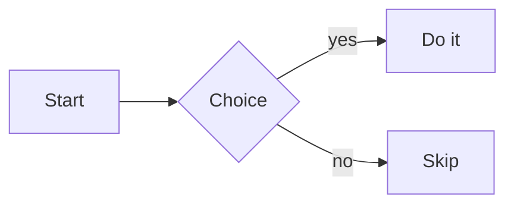

# DOCX Export Test

Paragraph with **bold**, *italic*, ~~strike~~, `inline code`, and a [link](https://example.com).

## Lists

- Bullet one
  - Nested bullet
- Bullet two

1. First
2. Second

1. Restarted list first
2. Restarted list second

- [x] Done task
- [ ] Pending task

## Blockquote

> A quoted line.

## Table

| Name | Qty | Price |
|:-----|:---:|------:|
| Apple | 3 | 1.20 |
| Pear  | 5 | 0.90 |

---

## Code

```js
function greet(name) {
  // say hello
  return `Hello, ${name}` + 42;
}
```

## Math

Inline $E = mc^2$ and display:

$$\int_0^\infty e^{-x}\,dx = 1$$

## Diagram



## Image


